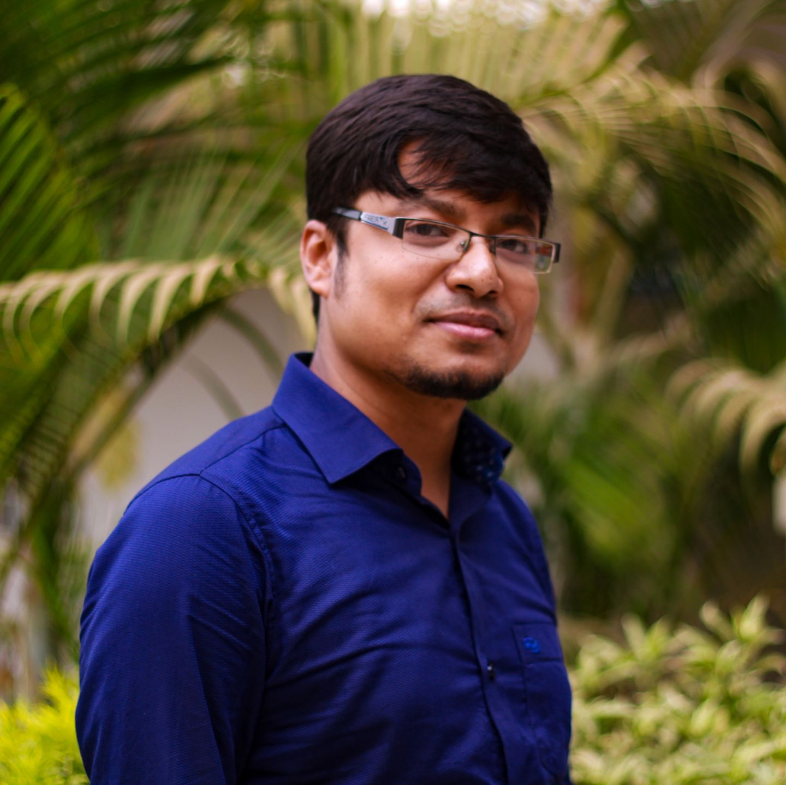

# Abdullah Al-Mamun, Ph.D.
_Assistant Professor_  
School of Computer and Cyber Sciences  
Augusta University  
Director, High-Performance & Secure Data Computing (HPSDC) Lab

[Email](mailto:hpctalk@gmail.com) • [Resume](resume.pdf) • [Google Scholar](#) • [GitHub](https://github.com/aalmamuncse)

---

## 👋 About Me

I am a tenure-track assistant professor at Augusta University and the director of the HPSDC Lab.  
My research focuses on high-performance blockchain systems, scalable data management, and privacy-preserving workflows for scientific and edge computing.

Previously, I earned my Ph.D. in Computer Science from the University of Nevada, Reno, advised by [Prof. Dongfang Zhao](https://faculty.washington.edu/dzhao/). I hold a joint M.Sc. degree from RWTH Aachen and the University of Trento under the EUMI Erasmus Mundus program.

---

## 🔬 Research Interests

- High-performance Blockchain Architecture  
- Resource-efficient High-Performance Computing  
- Extreme-scale and Secure Data Management  
- Scientific Workflow Provenance  

---

## 🏆 Selected Publications

- **ZTP:** A Scalable and Lightweight Privacy-Preserving Blockchain. _ICPP'25_  
- **BAASH:** Blockchain-As-A-Service for HPC Systems. _SC'21_  
- **SciChain:** Blockchain-enabled Provenance for Reproducible Science. _ICDE'21_  
- **Reflector:** A Fine-Grained I/O Tracker for HPC Systems. _PPoPP'20_  
- [View full list →](#)

---

## 🎓 Teaching

- **Fall 2025:** CSCI-7585: High-Performance Computing (Graduate)  
- CSCI 3371/5371: Low-level Programming Language  
- CSCI 7580: Computer Architecture and Parallel Processing  
- Database Management Systems  
- Operating Systems  

---

## 👩‍🔬 Students (Ph.D.)

- Amena Farha  
- Mohsin Rasheed  
- Abdullah Melhem (Co-advise)  
- Ramesh Adhikari (Co-advise)  
- Maksuda Rabeya (Co-advise)  

---

## 🏅 Awards & Grants

- **NSF CRII** — $165,000, 2024–2026  
- **Google Cloud Research Grant** — $10,000  
- **Best Paper Award** — IEEE CLOUD'19  
- **Outstanding Graduate Student** — UNR 2020 & 2021  
- **Summa Cum Laude (Gold Medal)** — AIUB  

---

## 🤝 Academic Service

- Reviewer: IEEE IoT, Journal of Big Data, IEEE TCE, IJCIS  
- Program Committee: IEEE IPDPS’23, SocSys Congress, CORETA  
- Advisor: ACM SIG Club, Augusta University

---

© Abdullah Al-Mamun. Built with [GitHub Pages](https://pages.github.com/) using the [Minimal theme](https://github.com/pages-themes/minimal).
